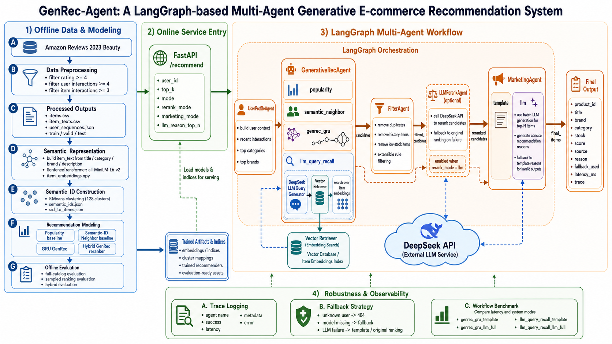

# GenRec-Agent

**GenRec-Agent** is a LangGraph-based LLM-guided multi-agent recommendation service for e-commerce scenarios. It combines Semantic-ID / Hybrid GenRec candidate generation, LLM-guided semantic query recall, candidate-constrained LLM reranking, batch recommendation reason generation, trace logging, fallback strategies, and workflow latency benchmarking.

GenRec-Agent 是一个面向电商推荐场景的 LLM-guided 多 Agent 推荐服务。项目基于 **FastAPI + LangGraph + DeepSeek API** 构建状态图工作流，集成用户画像、生成式推荐、LLM semantic query recall、业务过滤、候选集内 LLM 重排、推荐理由生成、fallback、trace 与 workflow latency benchmark。

本项目的目标不是复现完整工业级推荐系统，而是构建一个**可本地运行、可评估、可观测、可降级、支持真实 LLM Agent 增强**的推荐系统原型。

---

## System Architecture

<p align="center">
  
</p>

The architecture consists of four layers:

1. **Offline Data & Modeling**: preprocesses Amazon Reviews 2023 Beauty data, builds item text embeddings, constructs Semantic IDs, trains GRU GenRec / Hybrid GenRec models, and runs offline evaluation.
2. **Online Service Entry**: exposes the `/recommend` API through FastAPI with configurable `mode`, `rerank_mode`, `marketing_mode`, and `llm_reason_top_n`.
3. **LangGraph Multi-Agent Workflow**: orchestrates `UserProfileAgent`, `GenerativeRecAgent`, `LLMQueryRecallAgent`, `FilterAgent`, `LLMRerankAgent`, and `MarketingAgent`.
4. **Robustness & Observability**: records trace metadata, supports fallback strategies, and benchmarks workflow latency across different system modes.

---

## Key Features

- **LangGraph multi-agent workflow**: orchestrates `UserProfileAgent → GenerativeRecAgent / LLMQueryRecallAgent → FilterAgent → optional LLMRerankAgent → MarketingAgent`.
- **Semantic-ID based recommendation**: builds item text embeddings and one-level Semantic IDs for lightweight generative recommendation.
- **GRU GenRec model**: predicts the next semantic cluster from user behavior sequences and maps predicted clusters back to candidate items.
- **Hybrid GenRec reranker**: combines GRU cluster probability, Semantic-ID neighbor score, and popularity for offline reranking diagnostics.
- **LLM-guided semantic query recall**: `LLMQueryRecallAgent` uses DeepSeek to generate semantic queries from user behavior and maps them to real catalog products through local vector retrieval.
- **Grounded product recommendation**: the LLM does not directly generate product IDs; product candidates are retrieved from the local catalog and validated by downstream modules.
- **Candidate-constrained LLM reranking**: `LLMRerankAgent` reranks only within the candidate set and validates returned product IDs.
- **Batch LLM recommendation reasons**: `MarketingAgent` supports batch JSON reason generation for top-N items and template fallback for invalid outputs.
- **Cost and latency control**: `mode`, `rerank_mode`, `marketing_mode`, and `llm_reason_top_n` allow flexible trade-offs between speed, cost, and explanation quality.
- **Workflow benchmark**: compares endpoint-level latency, success rate, fallback flags, and agent-level runtime across local, LLM-enhanced, and full LLM-guided modes.
- **Fallback and observability**: records trace, latency, fallback status, provider, model, invalid IDs, query guardrail counts, and reason fallback counts.

---

## Version History

| Version | Description |
|---|---|
| `v0.1.0` | Core GenRec system: Semantic ID, GRU GenRec, FastAPI, LangGraph workflow, API benchmark, fallback validation |
| `v0.2.0` | DeepSeek LLM-enhanced pipeline: LLMRerankAgent, Batch LLMMarketingAgent, OpenAI-compatible LLMClient, mock / DeepSeek provider, LLM fallback and trace |
| `v0.3.0` | LLM-guided semantic query recall: LLMQueryRecallAgent, VectorRetriever, `mode=llm_query_recall`, query guardrails, workflow latency benchmark, system architecture diagram |

---

## Core Workflow

```text
FastAPI /recommend
        ↓
LangGraph Workflow
        ↓
UserProfileAgent
        ↓
Route by mode
   ├── mode = popularity / semantic_neighbor / genrec_gru
   │       ↓
   │   GenerativeRecAgent
   │
   └── mode = llm_query_recall
           ↓
       LLMQueryRecallAgent
       DeepSeek semantic query generation
           ↓
       VectorRetriever over local item embeddings
        ↓
FilterAgent
        ↓
Route by rerank_mode
   ├── rerank_mode = none → MarketingAgent
   └── rerank_mode = llm  → LLMRerankAgent → MarketingAgent
        ↓
Recommendation Response
```

### Agent Responsibilities

| Agent | Responsibility |
|---|---|
| `UserProfileAgent` | Builds user context from historical interactions, top categories, and top brands |
| `GenerativeRecAgent` | Generates candidates using Popularity, Semantic-ID Neighbor, or GRU GenRec |
| `LLMQueryRecallAgent` | Uses DeepSeek to generate semantic queries and retrieves real products through local vector search |
| `FilterAgent` | Removes duplicate, low-stock, and history items |
| `LLMRerankAgent` | Performs candidate-constrained LLM reranking and validates returned product IDs |
| `MarketingAgent` | Generates template or LLM-based recommendation reasons with item-level fallback |
| `LangGraph Workflow` | Controls state transitions, conditional routing, trace collection, and fallback propagation |

---

## LLM Agent Design

### OpenAI-Compatible LLMClient

The project implements a unified `LLMClient` that supports multiple providers:

| Provider | Purpose |
|---|---|
| `mock` | Local reproducible fake LLM for demos, CI-style checks, and fallback tests |
| `deepseek` | Main real LLM provider through DeepSeek API |
| `openai` | OpenAI-compatible API |
| `ollama` | Local OpenAI-compatible server, such as local Qwen2.5 |

All providers share the same agent logic:

```text
LLMClient
→ JSON structured output
→ timeout control
→ error capture
→ fallback handled by Agent
→ trace metadata
```

### LLMQueryRecallAgent

`LLMQueryRecallAgent` enables LLM-guided candidate recall.

```text
user_context
→ DeepSeek semantic query generation
→ semantic_query
→ VectorRetriever
→ local item embedding search
→ retrieved candidate products
```

Key safety boundary:

```text
The LLM does not directly generate product IDs.
The LLM only generates a semantic query.
Product candidates come from the local product catalog.
```

The agent also supports:

- query specificity guardrails
- ambiguous retrieval filtering, such as non-skincare “mask” items
- fallback to non-LLM GenRec path when query generation or vector retrieval fails

### LLMRerankAgent

`LLMRerankAgent` does not recommend from the full catalog. It only reranks candidates generated by the recommender:

```text
candidate items
→ LLMRerankAgent
→ reranked_product_ids
→ product_id validation
→ final candidate order
```

Core constraints:

```text
LLM can only return product IDs from the given candidate list.
Invalid product IDs are filtered and recorded in trace.
If LLM call fails, fallback to original ranking.
```

### Batch LLMMarketingAgent

`MarketingAgent` supports two modes:

| Mode | Behavior |
|---|---|
| `template` | Uses deterministic template reasons |
| `llm` | Uses batch LLM reason generation and template fallback |

Batch LLM reason generation:

```text
Top-N items
→ 1 DeepSeek API call
→ {"reasons": [{"product_id": "...", "reason": "..."}]}
→ validate product_id-reason mapping
→ fallback missing / invalid reasons to template
```

`llm_reason_top_n` controls the number of items that receive LLM-generated reasons, reducing latency and cost.

---

## LLM-guided Semantic Query Recall

GenRec-Agent supports `mode=llm_query_recall`, enabling LLM-guided candidate recall before downstream filtering, reranking, and recommendation explanation.

Unlike direct LLM recommendation generation, the LLM does **not** generate product IDs. Instead, DeepSeek generates a semantic search query from the user's recent behavior. The system then maps this query to real catalog products using local item embeddings and cosine similarity retrieval.

### Pipeline

```text
UserProfileAgent
→ LLMQueryRecallAgent
→ FilterAgent
→ optional LLMRerankAgent
→ MarketingAgent
```

### Key Design

- `LLMQueryRecallAgent` uses DeepSeek to generate a semantic query from user behavior.
- `VectorRetriever` maps the semantic query to real products from the local catalog.
- The LLM does not directly generate or decide product IDs.
- Retrieved products still pass through `FilterAgent`.
- Optional `LLMRerankAgent` performs candidate-constrained reranking.
- `MarketingAgent` supports top-N LLM-generated recommendation reasons via `llm_reason_top_n`.

### Safety and Robustness

- Product candidates are retrieved from the local product catalog, not hallucinated by the LLM.
- `invalid_ids` are checked during LLM reranking.
- Query specificity guardrails reduce overly broad LLM queries.
- Ambiguous retrieval results, such as non-skincare “mask” products, can be filtered before downstream ranking.
- LLM failures fall back to the non-LLM GenRec path.

### Example Request

```json
{
  "user_id": "AE23ZBUF2YVBQPH2NN6F5XSA3QYQ",
  "top_k": 10,
  "mode": "llm_query_recall",
  "rerank_mode": "llm",
  "marketing_mode": "llm",
  "llm_reason_top_n": 3
}
```

### Validated Behavior

The full v0.3.0 pipeline has been validated as:

```text
UserProfileAgent
→ LLMQueryRecallAgent
→ FilterAgent
→ LLMRerankAgent
→ MarketingAgent
```

The trace records:

```text
generated semantic_query
llm_decides_products = false
retrieval_backend = numpy_cosine
invalid_ids = []
llm_batch_input_items = 3
template_reason_items = 7
```

This makes the system an LLM-guided recommendation service rather than an uncontrolled LLM product generator.

---

## Dataset

The project uses the **Amazon Reviews 2023 - All Beauty** subset.

### Data Processing Strategy

- Positive feedback definition: `rating >= 4`
- User filtering: each user has at least 4 positive interactions
- Item filtering: each item has at least 3 interactions
- User behavior sequences are sorted by timestamp
- Leave-one-out splitting is used to construct train / valid / test

### Processed Dataset Statistics

| Item | Value |
|---|---:|
| Users | 845 |
| Items | 1,442 |
| Interactions | 6,628 |
| Train samples | 3,248 |
| Valid samples | 845 |
| Test samples | 845 |

---

## Semantic ID Construction

Each item is represented using:

```text
title + category + brand + description
```

The item text is encoded by SentenceTransformer and clustered by KMeans to construct one-level Semantic IDs:

```text
item_text → embedding → KMeans cluster → semantic_id
```

Current lightweight Semantic ID setup:

```text
semantic_id = [cluster_id]
n_clusters = 128
```

This is an engineering-oriented simplification of TIGER-style Semantic IDs. Full RQ-VAE / multi-level Semantic ID generation is left as future work rather than the mainline implementation.

---

## Recommendation Methods

### Popularity Baseline

Ranks items by target-item frequency in the training set.

### Semantic-ID Neighbor Baseline

Uses the Semantic ID clusters of user history items to retrieve items from neighboring semantic clusters and ranks them with popularity.

### GRU GenRec

GRU GenRec takes the sequence of historical Semantic ID clusters and predicts the next Semantic ID cluster:

```text
history semantic clusters → GRU → next semantic cluster → candidate items
```

The predicted cluster is mapped back to candidate products through `sid_to_items.json`.

### Hybrid GenRec Reranker

Hybrid GenRec combines GRU cluster probability, Semantic-ID neighbor score, and popularity:

```text
score(item) =
  alpha * GRU cluster probability
+ beta  * Semantic-ID neighbor score
+ gamma * popularity score
```

---

## Offline Evaluation Results

### Full-catalog Evaluation

| Method | Test Recall@10 | Test Recall@20 | Test Recall@50 | Test NDCG@20 | Test NDCG@50 |
|---|---:|---:|---:|---:|---:|
| Popularity | 0.0012 | 0.0047 | 0.0284 | 0.0015 | 0.0061 |
| Semantic-ID Neighbor | 0.0237 | 0.0355 | 0.0746 | 0.0124 | 0.0202 |
| GRU GenRec | 0.0308 | 0.0438 | 0.0698 | 0.0166 | 0.0217 |

### Interpretation

Semantic-ID Neighbor significantly improves over Popularity, showing that text-derived Semantic IDs capture useful item neighborhoods. GRU GenRec further improves Recall@20 and NDCG@20 in the full-catalog setting, but the absolute values remain low due to the small and sparse Beauty subset. Therefore, additional diagnostic evaluations are used to better understand ranking behavior.

---

## Sampled Ranking & Hybrid GenRec Diagnostics

Besides full-catalog evaluation, this project includes sampled-candidate ranking and hybrid reranking diagnostics.

### Sampled-candidate Ranking

In sampled-candidate evaluation, each test case is evaluated over one target item and sampled negative items. This setting focuses on ranking ability within a fixed candidate set.

| Method | MRR | Recall@5 | Recall@10 | Recall@20 | NDCG@20 |
|---|---:|---:|---:|---:|---:|
| Popularity | 0.0433 | 0.0473 | 0.0911 | 0.1669 | 0.0577 |
| Semantic-ID Neighbor | 0.2372 | 0.3408 | 0.3929 | 0.4746 | 0.2834 |
| GRU GenRec | 0.1768 | 0.2556 | 0.3101 | 0.4118 | 0.2194 |

This result indicates that Semantic-ID Neighbor is a strong signal in the sparse Beauty subset.

### Hybrid GenRec Reranker

Validation-selected weights:

```text
alpha = 1.0
beta  = 0.5
gamma = 0.2
```

Test diagnostic results:

| Method | MRR | Recall@20 | NDCG@20 | Recall@50 | NDCG@50 |
|---|---:|---:|---:|---:|---:|
| Semantic-ID Neighbor | 0.0397 | 0.2426 | 0.0784 | 0.3231 | 0.0947 |
| Hybrid GenRec | 0.0424 | 0.2473 | 0.0816 | 0.3302 | 0.0983 |

Hybrid GenRec slightly improves over Semantic-ID Neighbor in the validation-selected test diagnostic setting, showing that GRU cluster probability provides complementary sequence information.

---

## DeepSeek LLM Agent Validation

### Validated Capabilities

| Capability | Result |
|---|---|
| DeepSeek API connection | Passed |
| LLMClient JSON parsing | Passed |
| LLMQueryRecallAgent semantic query recall | Passed |
| VectorRetriever local catalog retrieval | Passed |
| LLMRerankAgent candidate-constrained reranking | Passed |
| Invalid product ID check | Passed, `invalid_ids=[]` |
| Batch LLMMarketingAgent | Passed |
| LLMMarketing fallback | Passed |
| LLMRerank fallback | Passed |
| Full LangGraph workflow | Passed |

### Engineering Notes

- DeepSeek API is used through the OpenAI-compatible `/chat/completions` interface.
- LLMQueryRecallAgent does not create product IDs; it only generates semantic queries.
- LLMRerankAgent does not create new product IDs and only reranks candidate items.
- Batch LLMMarketingAgent reduces marketing generation from N LLM calls to 1 LLM call.
- LLM failures are handled with fallback to non-LLM recall, original ranking, or template reason generation.
- Agent trace records provider, model, latency, fallback status, invalid product IDs, query guardrail counts, and reason fallback counts.

---

## Workflow Latency Benchmark

We benchmark four workflow modes on 5 users from an AI application engineering perspective.

| Mode | Success Rate | Any Fallback Flag Rate | Avg Latency |
|---|---:|---:|---:|
| `genrec_gru_template` | 1.00 | 0.00 | 7.7 ms |
| `genrec_gru_llm_full` | 1.00 | 0.80 | 5381.3 ms |
| `llm_query_recall_template` | 1.00 | 0.00 | 1876.9 ms |
| `llm_query_recall_llm_full` | 1.00 | 0.20 | 7269.3 ms |

### Interpretation

- `genrec_gru_template` is the fastest local recommendation path.
- `llm_query_recall_template` adds one DeepSeek call for semantic query generation and has an average latency of about 1.88s.
- `genrec_gru_llm_full` adds LLM reranking and LLM recommendation reasons, increasing average latency to about 5.38s.
- `llm_query_recall_llm_full` is the most complete v0.3.0 pipeline, with semantic query recall, LLM reranking, and Top-3 LLM reason generation, averaging about 7.27s.
- `Any Fallback Flag Rate` indicates whether any fallback flag was raised during the workflow. It does **not** necessarily mean endpoint failure.
- All benchmarked modes achieved endpoint-level success rate of 1.00.
- The system exposes `mode`, `rerank_mode`, `marketing_mode`, and `llm_reason_top_n` to balance recommendation quality, explanation quality, cost, and latency.

---

## API Benchmark

The local non-LLM API path was benchmarked with:

```text
num_requests = 100
concurrency = 10
mode = genrec_gru
top_k = 10
```

| Metric | Value |
|---|---:|
| Success Rate | 100% |
| Fallback Rate | 0% |
| Avg Returned Items | 9.98 / 10 |
| Throughput | 595.83 req/s |
| Client Avg Latency | 14.06 ms |
| Client P95 Latency | 18.46 ms |
| Client P99 Latency | 23.62 ms |
| Server Avg Latency | 10.88 ms |
| Server P95 Latency | 12.62 ms |
| Server P99 Latency | 13.24 ms |

> Note: This benchmark is for the non-LLM local path. Real LLM latency depends on provider, network, model, and TopK size.

---

## Fallback Validation

The project validates multiple fallback cases:

| Case | Expected Behavior | Result |
|---|---|---|
| Normal model path | Use GRU GenRec | Passed |
| Missing model path | Fallback to Semantic-ID Neighbor | Passed |
| Unknown user_id | Return structured 404 trace | Passed |
| LLMMarketing API failure | Fallback to template reason | Passed |
| LLMRerank API failure | Fallback to original GenRec ranking | Passed |
| LLMQueryRecall failure | Fallback to non-LLM GenRec path | Passed |

Example:

```text
Missing model:
requested_mode = genrec_gru
used_mode = semantic_neighbor_fallback
fallback_used = true
num_returned = 10
```

LLM failure example:

```text
LLMRerankAgent:
rerank_mode = llm
rerank_applied = false
fallback_reason = llm_call_failed
fallback_used = true
```

---

## Installation

```bash
pip install -r requirements.txt
```

If installing manually:

```bash
pip install pandas numpy scikit-learn sentence-transformers torch
pip install fastapi uvicorn langgraph httpx python-dotenv
```

---

## LLM Configuration

### Mock Mode

`mock` mode requires no API key and is suitable for local reproducibility.

```env
LLM_PROVIDER=mock
LLM_TIMEOUT_SECONDS=20
LLM_USE_RESPONSE_FORMAT=true
```

### DeepSeek API Mode

Create a local `.env` file:

```bash
cp .env.example .env
```

Then edit `.env`:

```env
LLM_PROVIDER=deepseek
LLM_API_KEY=your_deepseek_api_key
LLM_BASE_URL=https://api.deepseek.com
LLM_MODEL=deepseek-chat
LLM_TIMEOUT_SECONDS=20
LLM_USE_RESPONSE_FORMAT=true
```

Security note:

```text
Do not commit .env.
Only .env.example should be committed.
```

---

## Data Preparation

### Step 1: Prepare Amazon Beauty Data

```bash
python scripts/prepare_amazon_beauty.py \
  --min_rating 4 \
  --min_user_interactions 4 \
  --min_item_interactions 3
```

### Step 2: Build Item Texts

```bash
python scripts/build_item_texts.py
```

### Step 3: Build Semantic IDs

```bash
python scripts/build_semantic_id.py \
  --n_clusters 128
```

### Step 4: Build Train / Valid / Test Splits

```bash
python scripts/build_splits.py
```

---

## Offline Evaluation Commands

### Popularity Baseline

```bash
python scripts/evaluate_popularity.py --exclude_history
```

### Semantic-ID Neighbor Baseline

```bash
python scripts/evaluate_semantic_baseline.py --exclude_history
```

### Train GRU GenRec

```bash
python scripts/train_genrec_gru.py \
  --exclude_history \
  --epochs 30 \
  --batch_size 64 \
  --lr 1e-3 \
  --hidden_dim 64 \
  --top_clusters 5
```

### Sampled Ranking Evaluation

```bash
python scripts/evaluate_sampled_ranking.py \
  --split test \
  --num_negatives 99 \
  --ks 5 10 20 \
  --exclude_history
```

### Hybrid GenRec Evaluation

```bash
python scripts/evaluate_hybrid_genrec.py \
  --split test \
  --ks 5 10 20 50 \
  --top_clusters 10 \
  --top_k_eval 50 \
  --alpha 1.0 \
  --beta 0.5 \
  --gamma 0.2 \
  --exclude_history
```

---

## Run FastAPI Service

```bash
uvicorn main:app --reload
```

Health check:

```bash
curl http://127.0.0.1:8000/health
```

### Default Recommendation Request

```bash
curl -X POST "http://127.0.0.1:8000/recommend" \
  -H "Content-Type: application/json" \
  -d '{
    "user_id": "AE23ZBUF2YVBQPH2NN6F5XSA3QYQ",
    "top_k": 10,
    "mode": "genrec_gru"
  }'
```

### LLM-enhanced Recommendation Request

```bash
curl -X POST "http://127.0.0.1:8000/recommend" \
  -H "Content-Type: application/json" \
  -d '{
    "user_id": "AE23ZBUF2YVBQPH2NN6F5XSA3QYQ",
    "top_k": 10,
    "mode": "genrec_gru",
    "rerank_mode": "llm",
    "marketing_mode": "llm",
    "llm_reason_top_n": 3
  }'
```

### LLM-guided Query Recall Request

```bash
curl -X POST "http://127.0.0.1:8000/recommend" \
  -H "Content-Type: application/json" \
  -d '{
    "user_id": "AE23ZBUF2YVBQPH2NN6F5XSA3QYQ",
    "top_k": 10,
    "mode": "llm_query_recall",
    "rerank_mode": "llm",
    "marketing_mode": "llm",
    "llm_reason_top_n": 3
  }'
```

---

## Example API Response

The following is a shortened example for the full LLM-enhanced pipeline. Real LLM latency depends on network condition, provider response time, and `llm_reason_top_n`.

```json
{
  "request_id": "dcac4f1b-5599-4fb4-aa5f-6e07ea38ee5a",
  "user_id": "AE23ZBUF2YVBQPH2NN6F5XSA3QYQ",
  "top_k": 10,
  "mode": "llm_query_recall",
  "marketing_mode": "llm",
  "rerank_mode": "llm",
  "fallback_used": false,
  "latency_ms": 7520.34,
  "items": [
    {
      "product_id": "B07YXB7TJ4",
      "score": 1.0,
      "source": "llm_query_recall+llm_rerank",
      "category": "All Beauty",
      "brand": "SKINESQUE",
      "title": "SKINESQUE Wake Up and Makeup Prep facial Sheet Mask antiaging detox moisturizing Nicinamicide essence korean skin care, 30 sheet masks per container",
      "price": -1.0,
      "stock": 10,
      "reason": "Popular in All Beauty with 30 sheet masks for daily skincare."
    }
  ],
  "trace": [
    {
      "agent": "UserProfileAgent",
      "success": true,
      "latency_ms": 0.28,
      "fallback_used": false
    },
    {
      "agent": "LLMQueryRecallAgent",
      "success": true,
      "latency_ms": 2933.80,
      "fallback_used": false,
      "metadata": {
        "semantic_query": "facial skincare kit with sheet masks and hair styling tools",
        "llm_decides_products": false,
        "retrieval_backend": "numpy_cosine",
        "retrieved_item_count": 50
      }
    },
    {
      "agent": "FilterAgent",
      "success": true,
      "latency_ms": 0.10,
      "fallback_used": false
    },
    {
      "agent": "LLMRerankAgent",
      "success": true,
      "latency_ms": 4087.99,
      "fallback_used": false,
      "metadata": {
        "rerank_mode": "llm",
        "rerank_applied": true,
        "llm_provider": "deepseek",
        "llm_model": "deepseek-chat",
        "invalid_ids": []
      }
    },
    {
      "agent": "MarketingAgent",
      "success": true,
      "latency_ms": 2287.86,
      "fallback_used": false,
      "metadata": {
        "reason_type": "llm",
        "llm_reason_mode": "batch_top_n",
        "llm_reason_top_n": 3,
        "llm_batch_input_items": 3,
        "template_reason_items": 7,
        "llm_provider": "deepseek",
        "llm_model": "deepseek-chat",
        "llm_batch_call_count": 1
      }
    }
  ]
}
```

---

## Test Commands

### LLM Client Test

```bash
python scripts/test_llm_client.py
```

### LLM Query Recall Test

```bash
python scripts/test_llm_query_recall.py
python scripts/test_llm_query_recall_full_pipeline.py
```

### LLM Marketing and Rerank Tests

```bash
python scripts/test_llm_marketing.py
python scripts/test_llm_rerank.py
python scripts/test_llm_full_pipeline.py
```

### Fallback Tests

Start the service first:

```bash
uvicorn main:app --reload
```

Run fallback validation:

```bash
python scripts/test_fallback.py
python scripts/test_llm_marketing_fallback.py
python scripts/test_llm_rerank_fallback.py
```

### Workflow Benchmark

```bash
python scripts/benchmark_workflow_modes.py \
  --max_users 5 \
  --top_k 10 \
  --llm_reason_top_n 3
```

---

## Project Structure

```text
genrec-agent/
├── agents/
│   ├── base.py
│   ├── user_profile.py
│   ├── generative_rec.py
│   ├── llm_query_recall.py
│   ├── filter.py
│   ├── llm_rerank.py
│   └── marketing.py
├── graph/
│   └── workflow.py
├── recommender/
│   ├── __init__.py
│   └── inference.py
├── schemas/
│   └── models.py
├── services/
│   ├── __init__.py
│   ├── llm_client.py
│   └── vector_retriever.py
├── scripts/
│   ├── prepare_amazon_beauty.py
│   ├── build_item_texts.py
│   ├── build_semantic_id.py
│   ├── build_splits.py
│   ├── evaluate_popularity.py
│   ├── evaluate_semantic_baseline.py
│   ├── evaluate_sampled_ranking.py
│   ├── evaluate_hybrid_genrec.py
│   ├── train_genrec_gru.py
│   ├── benchmark_api.py
│   ├── benchmark_workflow_modes.py
│   ├── test_langgraph_workflow.py
│   ├── test_llm_client.py
│   ├── test_llm_query_recall.py
│   ├── test_llm_query_recall_full_pipeline.py
│   ├── test_llm_marketing.py
│   ├── test_llm_rerank.py
│   ├── test_llm_full_pipeline.py
│   └── test_fallback.py
├── datasets/
│   ├── raw/
│   ├── processed/
│   └── sample/
├── models/
│   └── genrec_gru.pt
├── reports/
│   ├── results_summary.md
│   ├── workflow_benchmark_summary.md
│   ├── workflow_benchmark_results.json
│   ├── sampled_ranking_summary.md
│   ├── hybrid_genrec_test_summary.md
│   ├── api_benchmark_results.json
│   └── fallback_test_results.json
├── assets/
│   └── genrec_agent_architecture.png
├── .env.example
├── main.py
├── requirements.txt
└── README.md
```

---

## Design Notes

### Why LangGraph?

This project is not a free-form autonomous multi-agent chat system. It is a stateful recommendation workflow with deterministic stages:

```text
profile construction → candidate generation → filtering → optional LLM reranking → reason generation
```
LangGraph is used to explicitly model state transitions, conditional routing, traceability, and fallback propagation across agents. In this project, each agent has a clear responsibility, while the workflow controls when to call each agent based on request parameters such as `mode`, `rerank_mode`, and `marketing_mode`.

This design is more suitable for recommendation services than a fully autonomous ReAct-style agent, because recommendation systems have strong business constraints: product candidates must come from the catalog, filtering rules cannot be skipped, and LLM outputs must be validated before being used.

### Why Semantic ID?

Direct item-level prediction is difficult in sparse recommendation datasets because the item space is large and many products have limited interactions. Semantic ID reduces the prediction target from individual products to semantic clusters, making the recommendation model easier to train and more interpretable.

In this project, item text is built from:

```text
title + category + brand + description
```
Then SentenceTransformer encodes each item into an embedding, and KMeans assigns each item to a semantic cluster:
```text
item_text → embedding → KMeans cluster → semantic_id
```
This lightweight Semantic ID design allows GRU GenRec to predict the next semantic cluster from user behavior sequences and then map the predicted cluster back to candidate products through sid_to_items.json.

### Why LLM-guided Query Recall?

LLMs are good at summarizing user intent from sparse behavioral signals, but they should not directly generate product IDs. Direct LLM product generation may hallucinate nonexistent items, ignore inventory constraints, or bypass catalog filtering.

Therefore, this project uses DeepSeek to generate only a semantic query:
```text
user_context → DeepSeek → semantic_query
```
The actual products are retrieved from the local catalog through vector search:
```text
semantic_query → VectorRetriever → real catalog products
```
This keeps the LLM useful for intent understanding while grounding candidate generation in the product catalog.

### Why Candidate-Constrained LLM Reranking?

A fully open-ended LLM reranker could generate product IDs that do not exist in the candidate set or the catalog. To avoid this, LLMRerankAgent only receives a fixed candidate list and is required to return product IDs from that list.

The system validates returned IDs:
```text
candidate items
→ LLMRerankAgent
→ reranked_product_ids
→ product_id validation
→ final candidate order
```
If the LLM returns invalid IDs or the API call fails, the system falls back to the original candidate ranking. This makes LLM reranking controllable and safer for a recommendation workflow.

### Why Batch LLMMarketingAgent?

Generating recommendation reasons item by item would require one LLM API call per product, which increases latency and cost. Instead, MarketingAgent uses batch JSON generation for the top-N items:
```text
Top-N items
→ 1 DeepSeek API call
→ product_id-reason mapping
→ validation
→ fallback invalid reasons to template
```
This reduces the number of LLM calls while still allowing personalized and readable recommendation reasons. The parameter llm_reason_top_n controls how many top-ranked items receive LLM-generated reasons, making it possible to trade off explanation quality, latency, and cost.

### Why Keep Mock Mode?

Mock mode is kept for local reproducibility, CI-style testing, demo stability, and fallback validation when real API keys are unavailable.

It allows the workflow to be tested without depending on DeepSeek network availability:
```text
mock provider
→ deterministic JSON output
→ same Agent logic
→ no external API dependency
```
This is useful for development and testing because the system can still validate routing, JSON parsing, fallback behavior, and trace structure without real LLM calls.

### Why Workflow Benchmark?

LLM-enhanced workflows introduce additional latency because they call external models for semantic query generation, reranking, and recommendation reasons. Therefore, the project includes a workflow benchmark to compare different serving modes:
```text
genrec_gru_template
genrec_gru_llm_full
llm_query_recall_template
llm_query_recall_llm_full
```
The benchmark reports endpoint-level success rate, latency, fallback flags, and agent-level runtime. This helps quantify the trade-off between recommendation quality, explanation quality, LLM cost, and response speed.

---
## Limitations

- Current Semantic ID uses KMeans rather than full RQ-VAE or TIGER-style multi-level semantic codes.
- Dataset is a small processed subset of Amazon Reviews 2023 All Beauty, not a full-scale industrial dataset.
- Inventory is simulated because Amazon Reviews does not provide real stock information.
- Current GenRec model predicts one-level semantic clusters.
- LLM query recall quality depends on the generated semantic query and item embedding quality.
- Vector retrieval may retrieve weakly related items when the query is too broad.
- DeepSeek API latency depends on network and provider response time.
- Batch LLM reason quality may vary across items and should be controlled with stronger post-filtering in production.
- Workflow benchmark is a small local benchmark intended for system diagnosis, not a production load test.

---
## Future Work

- Add multi-level Semantic ID generation.
- Replace GRU with Transformer/T5-style semantic ID generation.
- Add local Qwen2.5 provider through Ollama or vLLM.
- Add query quality scoring for LLM-generated semantic queries.
- Add post-filter refill to guarantee stable Top-K after filtering.
- Add LLM output quality evaluation for recommendation reasons.
- Add LLM rerank A/B evaluation against non-LLM ranking.
- Add category / keyword guardrails for noisy vector retrieval results.
- Add Dockerfile and GitHub Actions CI with mock LLM mode.
- Evaluate on larger Amazon categories or multi-category data.

---
## Resume Summary

GenRec-Agent is a FastAPI + LangGraph based LLM-guided multi-agent recommendation service. It combines Semantic-ID / Hybrid GenRec candidate generation with DeepSeek-powered semantic query recall, candidate-constrained LLM reranking, and batch recommendation reason generation. The system supports API serving, trace logging, fallback validation, query guardrails, cost control through `llm_reason_top_n`, and workflow latency benchmarking across local and LLM-enhanced modes.
